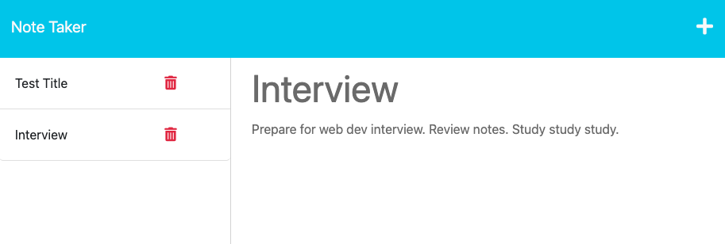

# Note Taker

## My Project

To create an application called Note Taker that can be used to write and save notes. This application will use an Express.js back end and will save and retrieve note data from a JSON file. This project will help me practice my Express.js skills. It will demonstrate I can connect the back-end with the front-end. The project will be deployed using Heroku. 

## User Story

```
AS A small business owner
I WANT to be able to write and save notes
SO THAT I can organize my thoughts and keep track of tasks I need to complete
```


## Acceptance Criteria

```
GIVEN a note-taking application
WHEN I open the Note Taker
THEN I am presented with a landing page with a link to a notes page
WHEN I click on the link to the notes page
THEN I am presented with a page with existing notes listed in the left-hand column, plus empty fields to enter a new note title and the note’s text in the right-hand column
WHEN I enter a new note title and the note’s text
THEN a Save icon appears in the navigation at the top of the page
WHEN I click on the Save icon
THEN the new note I have entered is saved and appears in the left-hand column with the other existing notes
WHEN I click on an existing note in the list in the left-hand column
THEN that note appears in the right-hand column
WHEN I click on the Write icon in the navigation at the top of the page
THEN I am presented with empty fields to enter a new note title and the note’s text in the right-hand column
```

## Installation

Have Node.js

Insall npm

## Notes

UPDATES: 

01/23/24 - All issues with the web application have been resolved. Have yet to deploy. 

## Usage

The following images show the web application's appearance and functionality:




## Links

This is my repository

[Repository](https://github.com/Gera1313/note-taker)

Will deploy to Heroku soon! Stay tuned!  

## Credits

[Learn Express JS In 35 Minutes](https://youtu.be/SccSCuHhOw0) 

## License

[](https://opensource.org/licenses/MIT)